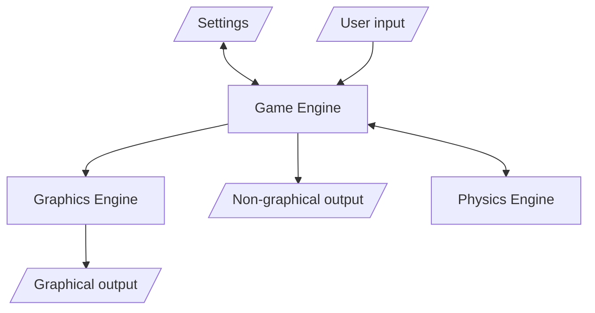
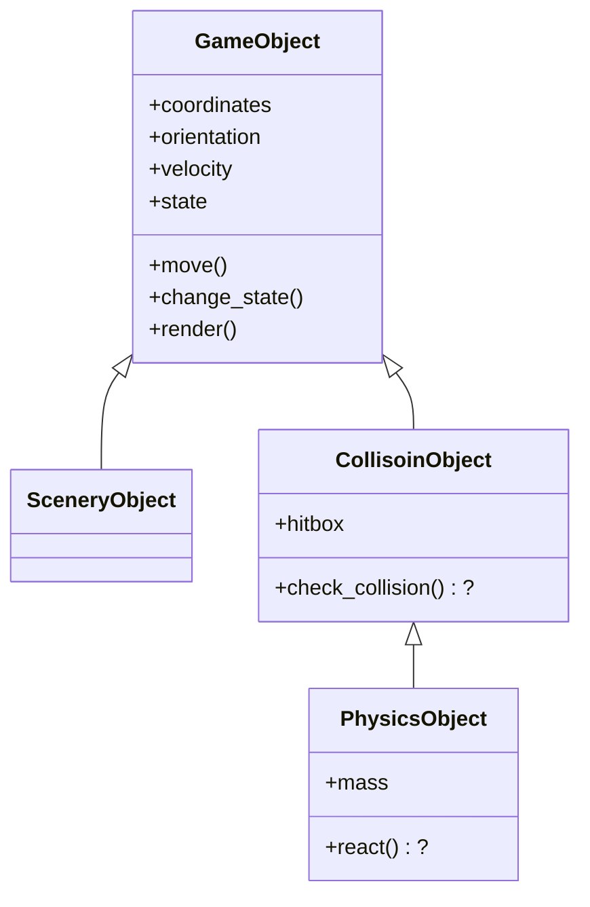

Flowchart

```mermaid
---
config:
  layout: dagre
  look: classic
  theme: default
---
flowchart TD
    n1["Game Engine <br>"] --> n3["Graphics Engine"] & n6["Non-graphical output <br>"]
    n1 <--> n2["Physics Engine"]
    n3 --> n7["Graphical output"]
    n4["Settings"] <--> n1
    n5["User input"] --> n1
    n6@{ shape: in-out}
    n7@{ shape: in-out}
    n4@{ shape: in-out}
    n5@{ shape: in-out}
```

```mermaid
---
  config:
    layout: dagre
    look: classic
    theme: default
---
  classDiagram
  direction TB
      class SceneryObject {
      }
      class GameObject {
	      +coordinates
	      +orientation
	      +velocity
	      +state
	      +move()
	      +change_state()
	      +render()
      }
      class CollisoinObject {
	      +hitbox
	      +check_collision() ?
      }
      class PhysicsObject {
	      +mass
	      +react() ?
      }

      GameObject <|-- SceneryObject
      GameObject <|-- CollisoinObject
      CollisoinObject <|-- PhysicsObject
```
